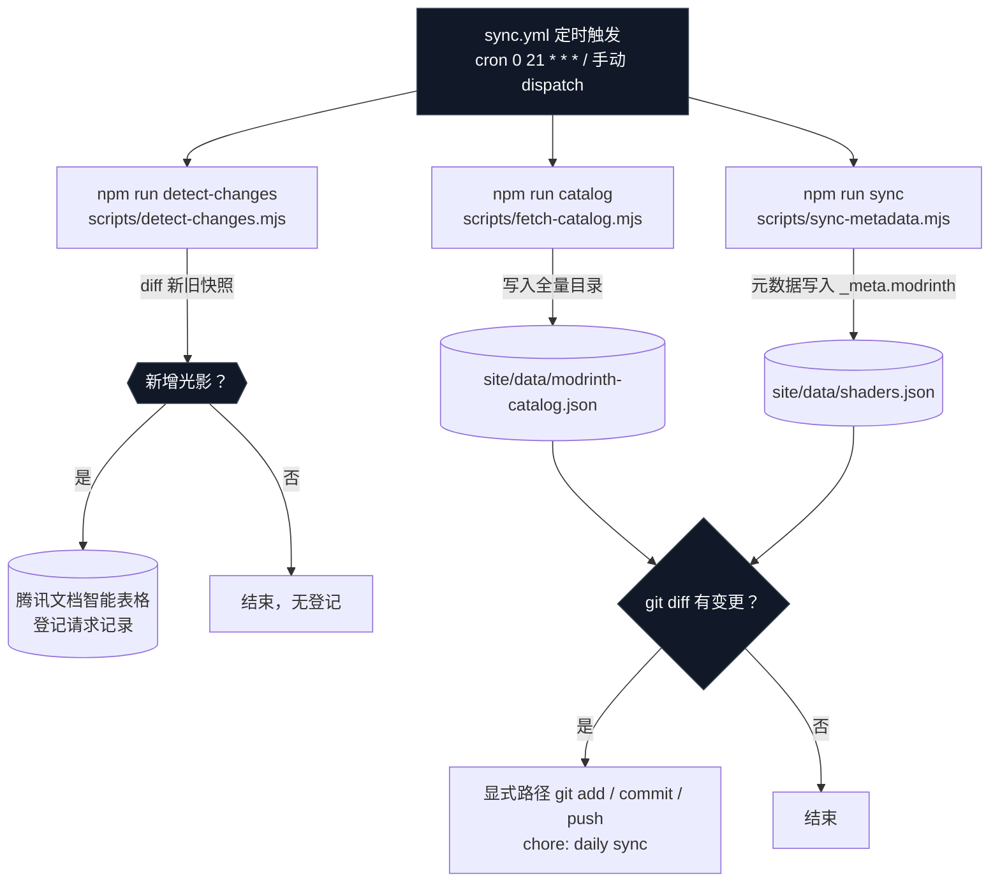
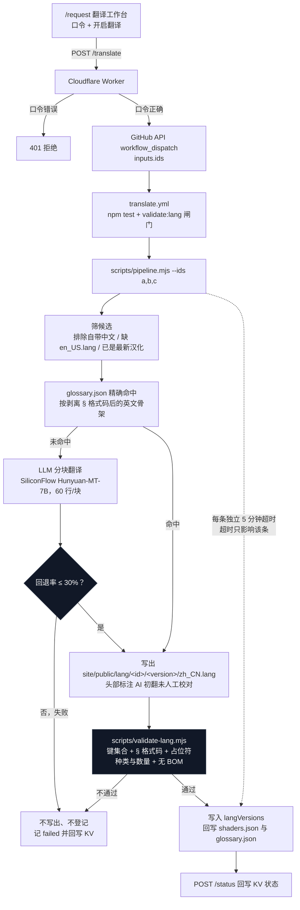
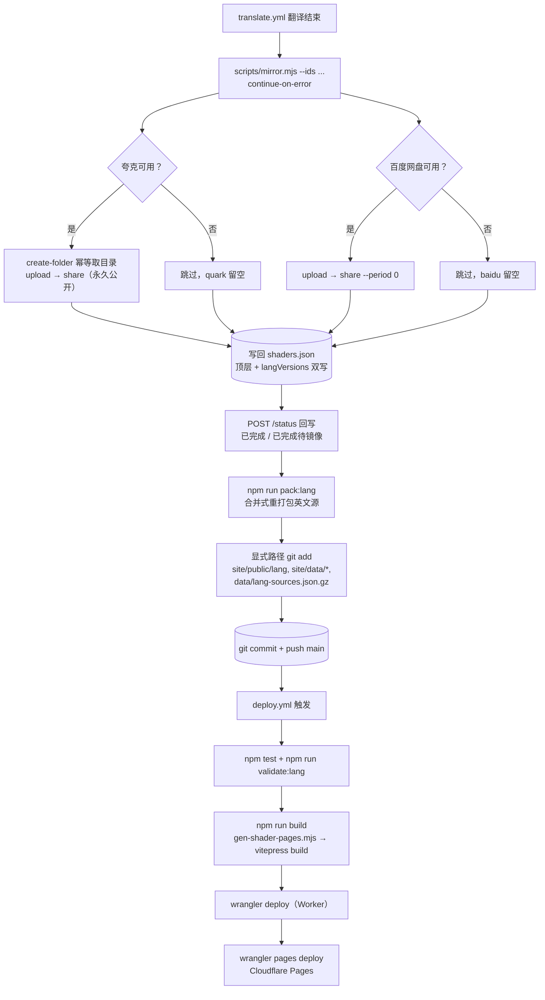
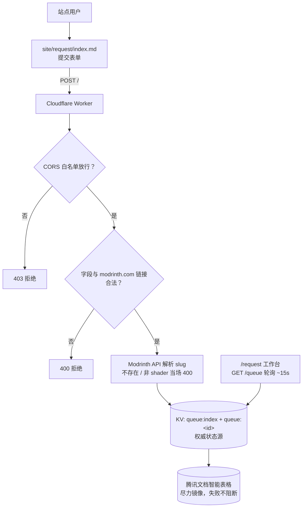
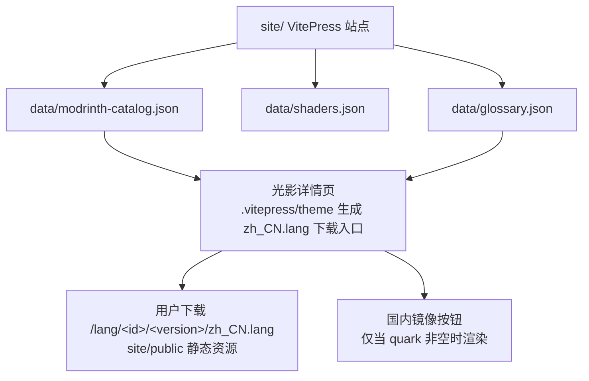

# Shader i18n 站点全流程

> 图示按真实代码路径与命令绘制，可配合 Mermaid 渲染查看。

## 1. 数据采集（GitHub Actions，每日 UTC 21:00）



要点：

- `catalog` 与 `sync` 并行跑，产物落 `site/data/`。
- `sync-metadata.mjs` 只写 `_meta.modrinth`，**永不覆盖人工已翻译的字段**（这是数据安全的边界）。
- `detect-changes.mjs` 拿的是 `modrinth-catalog.json` 的新旧快照对比，不是运行时检测；新增项写腾讯文档。
- 自动流程**不含**翻译与发布，站点内容不会因为同步而悄悄变化。
- `sync.yml` 与 `translate.yml` 共用 `concurrency: repo-write` 组，避免两个工作流同时 push 冲突。
- 字段结构（状态枚举、`buildFieldValues`）由 `shared/tencent-docs.mjs` 统一提供，Worker 与 Node 脚本共用同一份。

## 2. 翻译（站点触发或本地手动）



要点：

- 术语表 `glossary.json` 是**精确命中**：按去掉 `§e`、`§a[+]§c[-]` 这类格式码并 lowercased 的英文骨架比对。
- 全命中时**一次 LLM 都不调**。
- 分块回退率 > 10% 会整块重试（最多 3 次），整体 > 30% 直接判失败，**不写文件**。
- 校验失败即中止该条发布，不会留半个文件在仓库里；这是**唯一的质量闸门**，不再有人工确认环节。
- 闸门分线（`scripts/validate-lang.mjs`）：
  - **失败**（会真的渲染错）：缺键/多键、译文引入的**畸形 § 序列**（§ 后不是 `0-9a-fk-orx`）、非 `%%` 占位符差异、BOM、翻译新增的重复键、**找不到英文源**。
  - **警告**（只是样式选择）：§ 格式码数量差异、`%%` 差异、上游 EN 自带的乱码、继承自上游的重复键、值与英文相同。
- 英文源解析顺序：同目录 `en_US.lang` → `sources/<id>/<version>/en_US.lang` → `data/lang-sources.json.gz`。
  `sources/` 未入库（16 MB，版权属原作者），故 CI 靠 `data/lang-sources.json.gz`（约 2 MB）做真实比对；
  三处都找不到直接**判失败**，绝不退回「自检」产生假绿灯。
- `\u00a7` 字面转义会先解码为 `§` 再比对（部分光影把 § 写成转义序列，不解码会产生假失败）。
- 畸形 § 序列可自动修复：`npm run fix:lang`（`--dry-run` 只报告）；只修「译文多出来」的畸形，上游自带的乱码保留。
- 新增/更新英文源后需重跑 `npm run pack:lang` 刷新压缩包（与已有包合并，不会抹掉历史条目）。
- 每条光影独立 5 分钟超时（`AbortController` 同时中断进行中的 `fetch`），超时只让该条记失败，**其余条目继续完成**。
- `--ids` 与 `--top` 互斥；`--top` 行为与改造前完全一致（旧用法回归安全）。

## 3. 镜像、发布与部署（全自动）



要点：

- 镜像失败**不阻断发布**：任一网盘失败只让该字段留空，站点因此不渲染对应按钮（`quark` 为空 = 无「国内镜像」按钮）。
- 发布前先 `npm run pack:lang`：pipeline 已把本次新翻译的 `en_US.lang` 写入 `sources/`，重打包后 `data/lang-sources.json.gz` 才会包含它们；否则新光影在下一次 CI 校验时找不到英文源而**假失败**。打包是**合并式**的（CI 里 `sources/` 只有新增项，直接覆盖会抹掉已发布的 472 条）。
- 绝不伪造链接：拿不到真实 `share_url` / `link` 就写空字符串。
- 两个网盘互相独立，逐条串行 + 每条之间 `sleep(500)` 限流。
- 两个工作流都用**显式路径** `git add`，禁止 `git add -A`。
- `deploy.yml` 的顺序是「测试 → 校验 → 构建 → Worker → Pages」；Worker 必须先于 Pages 部署，否则线上 API 仍是旧版本。

## 4. 用户请求与队列（站点运行时）



要点：

- 状态权威源是 **KV**；腾讯文档只作「尽力而为」的镜像，任何失败都只记日志。
- 同一光影重复提交只更新时间（`updatedAt`），不重复入队。
- 状态枚举：`待翻译` → `翻译中` → `已完成` / `已完成待镜像` / `失败`。
- `/translate` 触发成功后立即把条目置为 `翻译中`，避免重复点击导致重复触发。

## 5. 站点消费层



## 一句话总览

```
每日 Actions 采数据（catalog / sync / detect）
        ↓
/request 提交 → Worker 写 KV 队列 → 点「开启翻译」→ translate.yml
        ↓
site/public/lang 下的 zh_CN.lang（pipeline 产出 + validate-lang 闸门）
        ↓
mirror.mjs 上传网盘并写回分享链接
        ↓
自动 commit + push → deploy.yml → Worker + Cloudflare Pages → 用户下载
```
