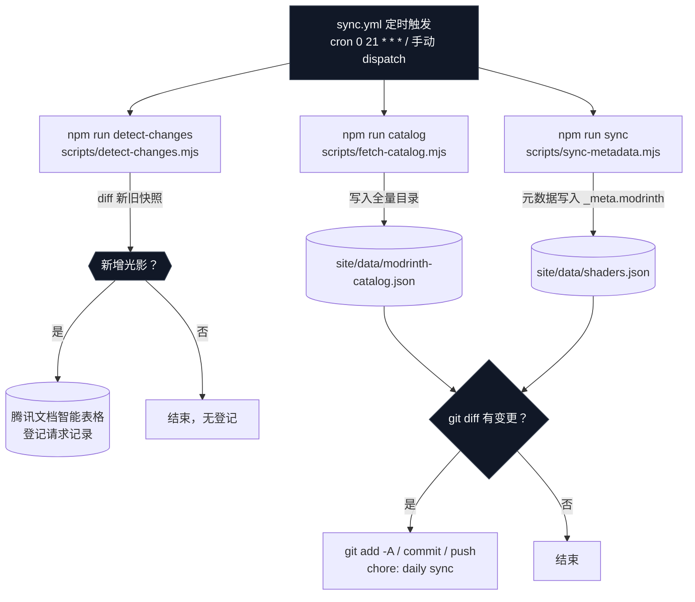
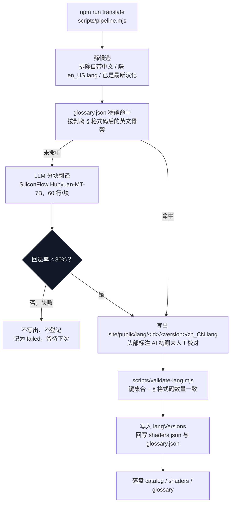
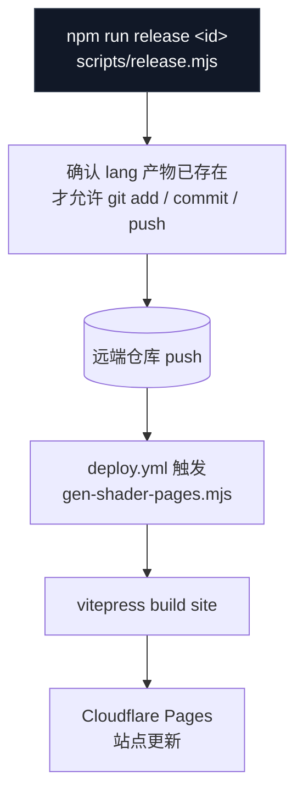
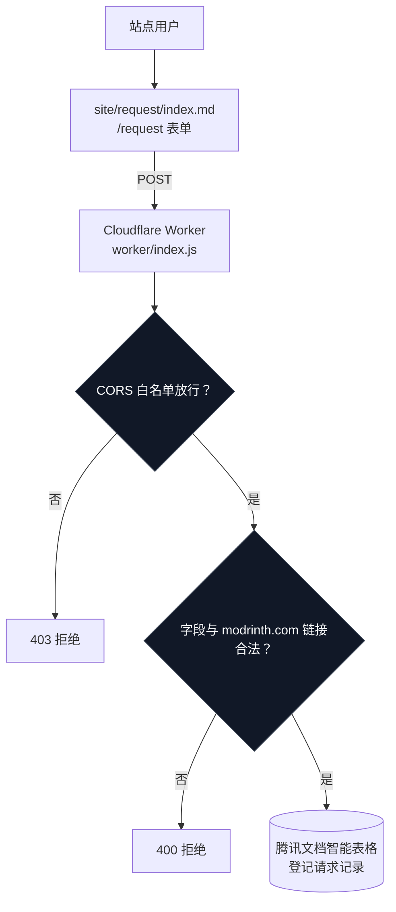
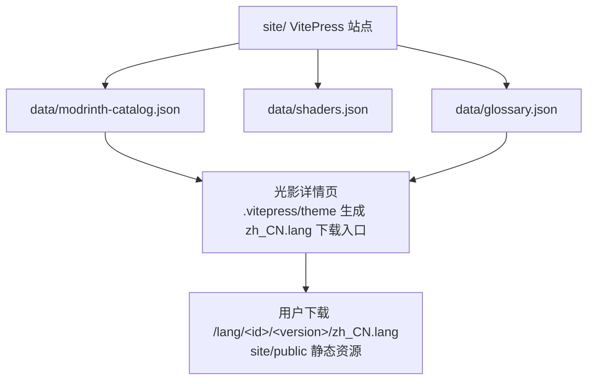

# Shader i18n 站点全流程

> 图示按真实代码路径与命令绘制，可配合 Mermaid 渲染查看。

## 1. 数据采集（GitHub Actions，每日 UTC 21:00）



要点：

- `catalog` 与 `sync` 并行跑，产物落 `site/data/`。
- `sync-metadata.mjs` 只写 `_meta.modrinth`，**永不覆盖人工已翻译的字段**（这是数据安全的边界）。
- `detect-changes.mjs` 拿的是 `modrinth-catalog.json` 的新旧快照对比，不是运行时检测；新增项写腾讯文档。
- 自动流程**不含**翻译与发布，站点内容不会因为同步而悄悄变化。

## 2. 翻译（本地人工驱动）



要点：

- 术语表 `glossary.json` 是**精确命中**：按去掉 `§e`、`§a[+]§c[-]` 这类格式码并 lowercased 的英文骨架比对。
- 全命中时**一次 LLM 都不调**。
- 分块回退率 > 10% 会整块重试（最多 3 次），整体 > 30% 直接判失败，**不写文件**。
- 校验失败即中止该条发布，不会留半个文件在仓库里。

## 3. 发布（本地人工确认）



## 4. 用户请求翻译链路（站点运行时）



要点：这条链路**只登记需求**，不触发下载、翻译或页面生成。

## 5. 站点消费层



## 一句话总览

```
每日 Actions 采数据（catalog / sync / detect）
        ↓
site/public/lang 下的 zh_CN.lang  ←—— 由人工本地跑 pipeline 产出（不自动）
        ↓
release 确认产物后才 push
        ↓
Actions 部署 → Cloudflare Pages → 用户下载 / 提交请求 → Worker → 腾讯文档
```

**已知当前卡点**（诚实说明，未修）：`candidate.json` 里 `register_db → release_cli` 这条主路径边在 render 阶段触发 `workflow/solver-budget-exhausted`，后面 43 条 composition 诊断（30 个 proper-crossing、12 个 ambiguous-corridor、1 个 arrowhead-collision）目前是被这条 rank-capacity 失败**抑制**的，`validate` 不会往下报。